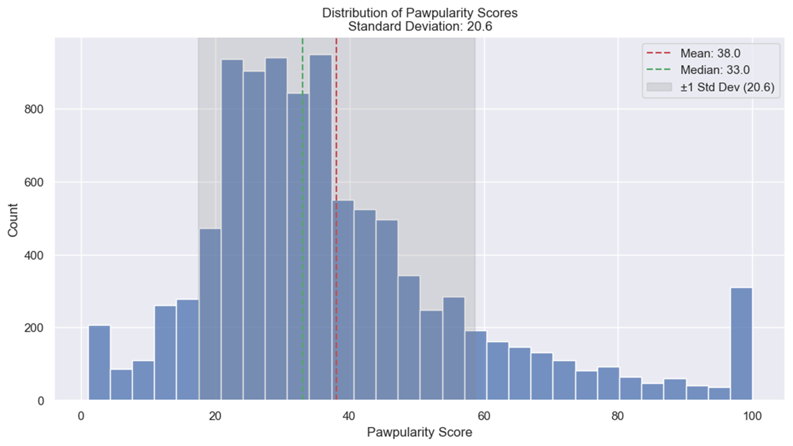

# Baseline Model Description

As per the Kaggle Challenge the baseline model is equal to the Standard deviation value of the dataset which is 20.6.

According to this, If we put all our pawpulartiy scores to mean that is 38.0, then we will have the RMSE of 20.6

Since the evaluation metric of the model is RMSE, therefore our Baseline value = 20.6 

**GOAL: RMSE < 20.6** 

