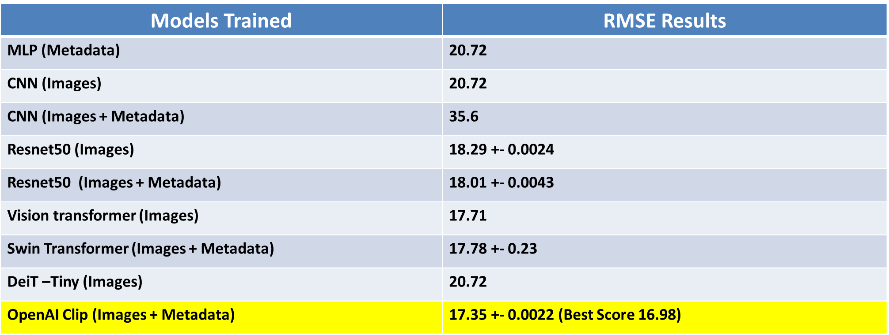

# PetFinder Pawpularity Contest - Deep Learning Models

### Intermediate Machine Learning Course Project: https://edu.opencampus.sh/

This repository contains the code and models used for the [Kaggle PetFinder.my - Pawpularity Contest](https://www.kaggle.com/competitions/petfinder-pawpularity-score). The goal of this challenge is to predict the **Pawpularity Score** of pet images based on their visual features.

## Models and Methods Used

The project explores multiple deep learning architectures for feature extraction and regression, including:

- **Convolutional Neural Networks (CNN)**
- **Multilayer Perceptron (MLP)**
- **Vision Transformer (ViT)**
- **Data-efficient Image Transformer (DeiT)**
- **Swin Transformer**
- **OpenAI CLIP Model**

Among these, **ViT (Vision Transformer)** achieved the best performance in predicting the Pawpularity Score.

## Installation

Clone the repository and install dependencies:

git clone https://github.com/ChristopherKunze-Git/PawScorePredictor.git
cd PetFinder-Pawpularity
pip install -r requirements.txt

### Results Achieved

## Acknowledgments
1. Kaggle for providing the dataset and competition platform.
2. Hugging Face Transformers for pre-trained ViT, DeiT, and Swin models.
3. OpenAI for the CLIP model.

### Authors
1. Christopher Kunze
2. Khushi Kala
